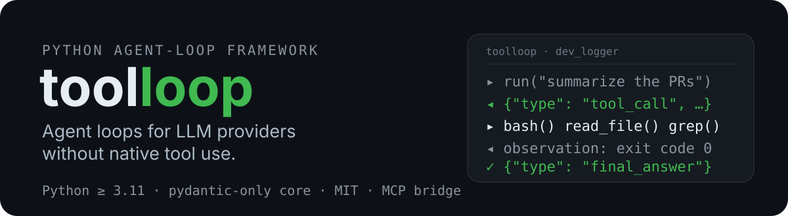

[English](https://github.com/apavanello/toolloop/blob/main/README.md) | [Português (BR)](https://github.com/apavanello/toolloop/blob/main/README.pt-br.md)

<p align="center">
  
</p>

[](https://github.com/apavanello/toolloop/actions/workflows/ci.yml)
[](https://pypi.org/project/toolloop/)
[](https://pypi.org/project/toolloop/)
[](LICENSE)

`toolloop` é um framework Python para construir agentes autônomos — uso de
tools, exploração, código — sobre qualquer endpoint de LLM, inclusive (e
principalmente) aqueles cujo SDK nunca expôs um parâmetro `tools`. Se você
consegue enviar mensagens e receber texto de volta, você consegue rodar um
agente nele.

> GitHub: <https://github.com/apavanello/toolloop> ·
> PyPI: <https://pypi.org/project/toolloop/> ·
> Documentação: <https://apavanello.github.io/toolloop>

## Por quê

Grande parte do acesso real a LLMs passa por SDKs corporativos privativos que
fazem proxy dos grandes providers (Anthropic, OpenAI, Kimi, DeepSeek, ...) mas
removem — ou nunca implementaram — a camada de tool use. Os modelos por trás
deles dão conta de trabalho agêntico perfeitamente; o SDK é que não carrega
function calls.

O `toolloop` resolve isso na camada de aplicação:

- **Traga o seu provider.** O framework nunca gerencia providers. O contrato
  inteiro é um método async: `complete(messages) -> str`.
- **Tools sobre texto puro.** Os schemas das tools são renderizados no system
  prompt; as chamadas são extraídas das respostas em texto do modelo. Erros de
  parse voltam para o modelo (auto-repair) até o envelope sair correto.
- **Loop até ficar satisfeito.** Dada uma entrada, o agente chama tools,
  recebe observações e itera até emitir um `final_answer`.

## Instalação

Requer Python 3.11+.

```bash
pip install toolloop                    # core (só pydantic)
pip install "toolloop[all]"             # tudo abaixo de uma vez
pip install "toolloop[openai]"          # + adapters OpenAICompat/OpenRouter
pip install "toolloop[anthropic]"       # + adapter Anthropic
pip install "toolloop[otel]"            # + auto-instrumentação OpenTelemetry
pip install "toolloop[mcp]"             # + bridge MCP (Model Context Protocol)
```

A partir do código-fonte: `uv sync --extra dev`.

## Quickstart (sem LLM)

```python
import asyncio

from toolloop import Agent, tool


@tool
async def add(a: int, b: int) -> int:
    """Soma dois números."""
    return a + b


class DemoProvider:
    """Um provider scriptado fazendo o papel do seu provider real."""

    def __init__(self):
        self.turns = [
            '{"type": "tool_call", "calls": [{"id": "c1", "name": "add", "args": {"a": 2, "b": 3}}]}',
            '{"type": "final_answer", "output": "2 + 3 = 5"}',
        ]

    async def complete(self, messages):
        return self.turns.pop(0)


agent = Agent(DemoProvider(), tools=[add])
result = asyncio.run(agent.run("quanto é 2 + 3?"))
print(result.output)  # 2 + 3 = 5
print(result.status)  # Status.COMPLETED
print(result.history[0].calls[0].result)  # 5
```

## Traga o seu provider

Implemente um método async e pronto — SDK, HTTP puro, o que for:

```python
class MeuProviderCorporativo:
    async def complete(self, messages):
        response = await meu_sdk_corporativo.chat(
            [{"role": m.role.value, "content": m.content} for m in messages]
        )
        return response.text
```

Ou use um adapter pronto de `toolloop.providers` (testados, com as
peculiaridades de cada provider tratadas — ex.: o round-trip de
`reasoning_details` do OpenRouter para modelos de reasoning):

```python
from toolloop.providers import OpenRouterProvider

provider = OpenRouterProvider("openai/gpt-4o-mini", reasoning=True)
```

Comece por [`examples/`](examples/) — um tour prático, do primeiro agente
offline passando por hooks, subagentes e gestão de contexto, até providers
reais e aplicações, incluindo um sumarizador de repositórios no
[OpenRouter](examples/repo_summarizer.py).

## Tour

### Definindo tools

```python
@tool  # nome = função, schema = type hints
async def search_docs(query: str, limit: int = 5) -> str:
    """Busca na documentação interna."""
    ...


@tool(dangerous=True)  # marcada para hooks de aprovação
async def run_migration(env: str) -> str:
    """Roda a migração do banco."""
    ...
```

Os argumentos são validados com pydantic; argumentos inválidos e exceções
levantadas viram observações de erro das quais o modelo se recupera — nada
derruba o loop.

### Executando agentes

```python
result = await agent.run(
    "resuma os PRs abertos",
    max_iterations=25,
    on_max=OnMax.WRAP_UP,  # ou RAISE (padrão) ou PARTIAL
    output_model=Summary,  # modelo pydantic: saída estruturada validada
)
result.status  # Status.COMPLETED | Status.MAX_ITERATIONS
result.output  # str, ou uma instância de Summary validada
result.history  # trilha de auditoria completa de cada passo e chamada
```

### Modos de controle e hooks

Dois modos, configuráveis no `Agent` e sobrescreíveis por `run()`:

- **`ControlMode.BYPASS`** (padrão) — autônomo; hooks ainda podem vetar ou
  reescrever chamadas.
- **`ControlMode.APPROVE`** — default-deny; toda chamada de tool precisa ser
  liberada por um hook `on_tool_call` (humano-no-loop).

```python
async def gatekeeper(ctx) -> Decision:
    if ctx.dangerous:
        answer = input(f"liberar {ctx.name}({ctx.args})? [y/N] ")
        return Decision.allow() if answer == "y" else Decision.deny("não")
    return Decision.allow()


agent = Agent(provider, tools=STD_TOOLS, control=ControlMode.APPROVE, on_tool_call=gatekeeper)
```

Um gate pronto para uso está incluído — `console_approver` libera tools
seguras em silêncio e pergunta a um humano apenas as marcadas com
`dangerous=True`:

```python
from toolloop import console_approver

agent = Agent(
    provider, tools=STD_TOOLS, control=ControlMode.APPROVE, on_tool_call=console_approver()
)
```

Os hooks `on_step` e `on_tool_result` dão observabilidade total (auditoria,
logging, tracing) nos dois modos.

### Tool calls paralelas

O padrão é sequencial (determinístico). Defina `max_parallel_calls` para
executar concorrentemente as chamadas de um mesmo turno — as aprovações
continham sendo perguntadas uma a uma e os resultados são remontados na ordem
original:

```python
agent = Agent(provider, tools=[fetch, grep], max_parallel_calls=4)
```

### Streaming (opcional, só UX)

Se o seu provider implementa o método opcional `stream()` (async iterator de
deltas) e você passa `on_delta`, o agente faz streaming mantendo o
comportamento idêntico — o texto acumulado é parseado como qualquer resposta
de `complete()`:

```python
class MeuProvider:
    async def complete(self, messages) -> str: ...

    async def stream(self, messages):  # opcional
        async for delta in upstream:
            yield delta


agent = Agent(MeuProvider(), tools=[...], on_delta=print_delta)
```

### Gestão de contexto

Defina `max_context_tokens` e o agente mantém a conversa dentro do orçamento:
observações antigas são truncadas primeiro, depois o meio da conversa é
compactado via sumarização pelo próprio provider. O toolset padrão já retorna
resultados compactos por design (uma tool de escrita confirma o tamanho
escrito, sem ecoar o conteúdo).

```python
agent = Agent(provider, tools=STD_TOOLS, max_context_tokens=16_000)
```

O orçamento usa por padrão uma heurística de ~4 caracteres por token; plugue
o seu contador (ex.: tiktoken com a encoding do seu modelo) com
`token_counter=`.

### Persistência de sessão

Fotografe uma conversa e retome depois — inclusive em outro processo. O
estado é dado (mensagens + trilha de auditoria); provider, tools e hooks são
código e são reconstruídos no resume:

```python
state = agent.to_state()
open("session.json", "w").write(state.to_json())  # persista onde quiser

# depois:
from toolloop import AgentState

state = AgentState.from_json(open("session.json").read())
agent = Agent.from_state(state, provider, tools=[...])
await agent.run("agora, o próximo passo")  # continua a mesma conversa
```

### Observabilidade

Com `opentelemetry` instalado (`pip install "toolloop[otel]"`), o loop é
auto-instrumentado — spans para `run` → `step` → `tool`, com erros de parse
como eventos. Sem o SDK, a instrumentação vira no-op e o core não carrega
dependência extra. Injete um tracer próprio com `Agent(..., tracer=tracer)`.

### Logging de desenvolvimento

O loop emite records pelo `logging` padrão no logger `toolloop`. Uma linha
manda tudo para o terminal ou arquivo — o jeito mais rápido de assistir um
agente trabalhar durante o desenvolvimento:

```python
from toolloop.devlog import dev_logger

dev_logger()  # -> stderr, ao vivo
dev_logger("run.log")  # -> arquivo
```

INFO cobre cada passo, chamadas de tools (nome, args, status, duração, preview
do resultado) e desfechos do run; erros de parse chegam como warnings; os
envelopes crus ficam no DEBUG. Por ser logging stdlib, compõe com qualquer
handler e formatter que você já use.

### Subagentes

Transforme um agente em tool: ele explora com o próprio contexto isolado e
só a resposta final volta para quem chamou.

```python
from toolloop import subagent_tool

researcher = Agent(provider, tools=[search_docs])
agent = Agent(provider, tools=[subagent_tool(researcher), write_file])
```

### Tools MCP (Model Context Protocol)

Exponha as tools de qualquer servidor MCP ao seu agente — o ecossistema MCP
inteiro de graça. Os argumentos passam sem alterações (o servidor valida por
conta própria com o `inputSchema` dele, renderizado verbatim no system
prompt):

```python
from toolloop.mcp import McpServerConfig, mcp_tools

config = McpServerConfig(command="uvx", args=["mcp-server-fetch"])
# ou:  McpServerConfig(url="https://example.com/mcp", headers={...})

async with mcp_tools(config) as tools:  # também aceita uma lista de configs
    agent = Agent(provider, tools=tools)  # tools vivas apenas dentro do with
    await agent.run("busque o README do toolloop")
```

Requer `pip install "toolloop[mcp]"`. Um exemplo totalmente offline (que
sobe o próprio servidor MCP) está em
[`examples/06_mcp_tools.py`](examples/06_mcp_tools.py).

### Uso sync

Scripts sem event loop podem usar `run_sync`:

```python
from toolloop import run_sync

result = run_sync(agent, "quanto é 2 + 3?")
```

### Endurecimento para produção

O que você quer antes de confiar um agente com trabalho de verdade:

```python
from toolloop import Agent, rate_limited

provider = rate_limited(MeuProvider(), concurrency=5, min_interval=0.2)  # compartilhado = global

agent = Agent(
    provider,
    tools=[...],
    max_retries=3,  # erros transitórios de gateway: backoff exponencial + jitter
    retry_backoff=0.5,
    provider_timeout=60,  # provider pendurado falha rápido em vez de travar
    checkpoint="session.json",  # snapshots incrementais de estado (ou um callable)
    checkpoint_every=10,  # ...a cada N passos, mais um ao fim de cada run
)
```

- **Retries** cobrem só falhas de transporte; erros de parse ficam com o
  auto-repair, e `CancelledError` nunca é retentado.
- **Checkpoints** sobrevivem a quedas: retome com `Agent.from_state(
  AgentState.from_json(open("session.json").read()), provider, tools)`.
- **Uso por run**: providers podem expor `last_usage()` (os adapters inclusos
  expõem); `RunResult.usage` soma ao longo do run.
- **Cancelamento** é graceful: a conversa é preservada e resumível, e a tool
  `bash` nunca deixa subprocessos para trás.

### Toolset padrão (opcional)

```python
from toolloop import STD_TOOLS
# bash, read_file, write_file, edit_file, list_files, grep
```

Toolset de coding agent em Python puro; importe ou ignore — o core não sabe
nada dele.

## Testando seus agentes

`toolloop.testing` traz helpers determinísticos de cenário — sem LLM, sem
rede, sem flakiness:

```python
from toolloop import Agent
from toolloop.testing import ScriptedProvider, final_answer, tool_call


async def test_agent_completes():
    provider = ScriptedProvider(
        [tool_call("search_docs", call_id="c1", query="pypi"), final_answer("done")]
    )
    result = await Agent(provider, tools=[search_docs]).run("busque pypi")
    assert result.output == "done"
    assert result.history[0].calls[0].status == "ok"
```

Esgotar o script falha alto (`AssertionError`), então cenários não podem
dissimular divergência entre expectativa e comportamento real.

## CLI

Scaffolding e validação de projetos (sem `run` — é uma biblioteca):

```bash
toolloop init my-agent   # scaffold completo em pasta vazia; em projeto
                         # existente, adiciona só os metadados que faltarem
toolloop check           # valida tools/agent declarados em [tool.toolloop]
```

O `toolloop init` nunca sobrescreve arquivos existentes, e o scaffold vem com
um teste de cenário offline. `python -m toolloop` também funciona.

## Projeto

- Licença: MIT
- Python: 3.11+
- Dependências: pydantic (apenas)
- Roadmap: [roadmap.md](roadmap.md) — orquestração de sub-agentes, evals, ...

## Como funciona

1. Os schemas das tools e o formato do envelope JSON são renderizados no
   system prompt por um `ToolProtocol` plugável (padrão: `JsonToolProtocol`).
2. O agente chama o provider e faz o parse do envelope da resposta:
   `tool_call` (uma lista de chamadas, sequenciais por padrão ou concorrentes
   com `max_parallel_calls`) ou `final_answer`.
3. Os resultados das tools são anexados como observações; erros de
   parse/validação voltam para o modelo corrigir a própria saída.
4. O loop termina no `final_answer`, no `max_iterations` (conforme a política
   configurada) ou quando um hook nega tudo.
